# WorldCRUD

22100084 김동연

---

## 프로젝트 개발 환경

* IDE
    * Intellij IDEA 2022.2.1 (Ultimate Edition)
      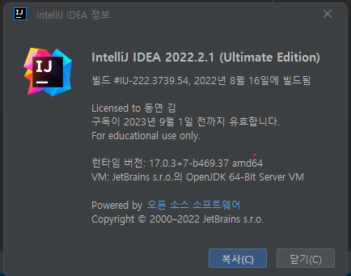

---

#### 구현 내용 중간 체크리스트

* [4. 단어 추가]
    * 작동 확인: O
    * 실행 화면:
      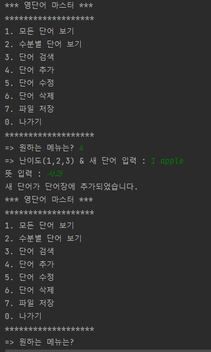
* [1. 모든 단어보기]
    * 작동 확인: O
    * 실행 화면:
      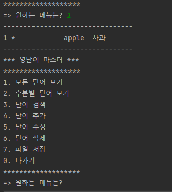
* [0. 나가기]
    * 작동 확인: O
    * 실행 화면:
      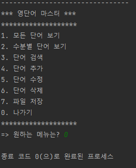

* 소감

`프로젝트를 진행하는 방법에 대해서 익숙해져가는 느낌을 배웠다.`

* 어려움

`intellij를 적응하는 것이 어려웠지만 사용했을 때 편했다 github사용 방법이 어려웠다.`

* 건의사항

`github 사용방법에 대한 정리 자료가 있었으면 좋겠습니다`

---
## 최종보고서
#### 구현 내용 최종 체크리스트

* [2. 수준별 단어보기]
  * 작동 확인 O
  * 실행 화면:
    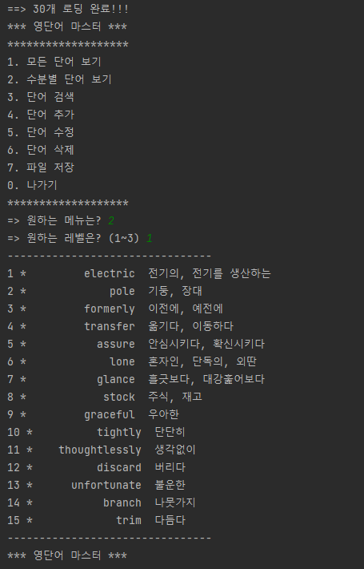

* [3. 단어 검색]
    * 작동 확인 O
    * 실행 화면:
    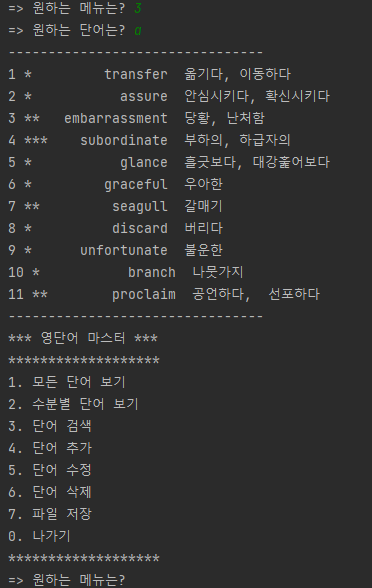

* [5. 단어 수정]
    * 작동 확인 O
    * 실행 화면:
    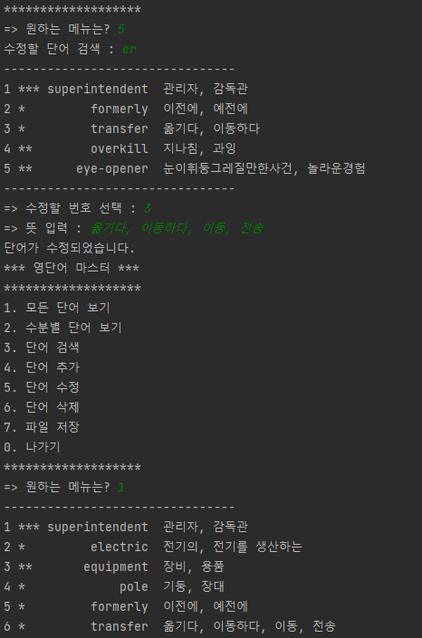

* [6. 단어 삭제]
    * 작동 확인 O
    * 실행 화면:
    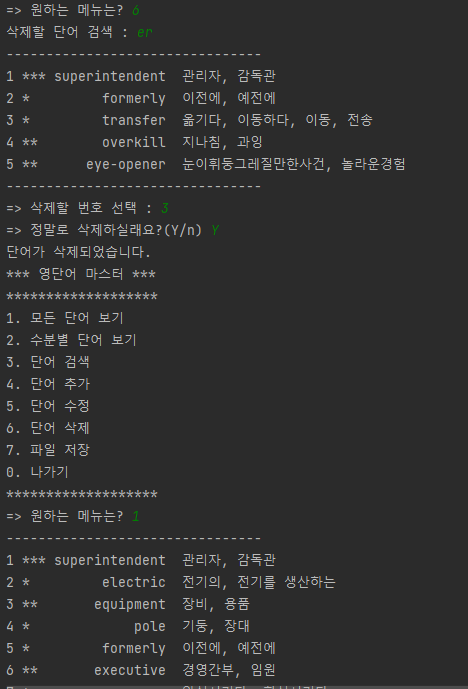
    `없어진 6번의 transfer를 확인할 수 있다.`

* [7. 파일저장]
    * 작동 확인 O
    * 파일 위치와 파일 이름 : WorldCRUD 프로젝트, Dictionary.txt
    * 실행 화면:
      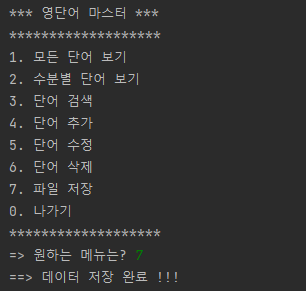
    * 파일 화면:
      * 변경 전:
        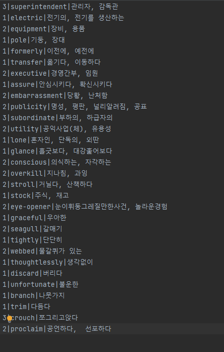
      * 변경 후:
        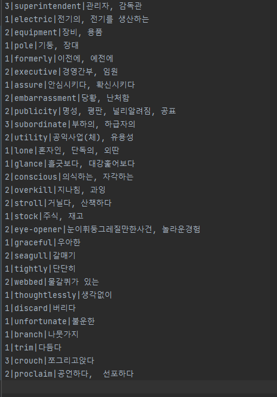

* 프로그램 재시작 후 [1. 모든 단어보기]
    * 작동 확인 O
    * 실행 화면:
      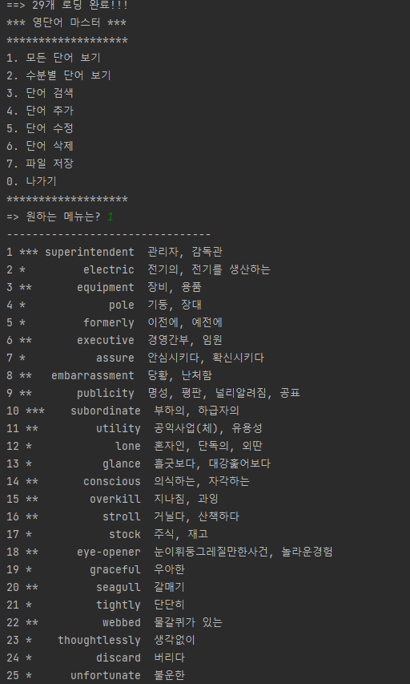